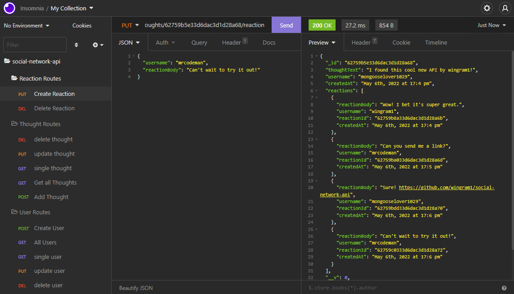

# Social Network API

## About the Project

Welcome to my Social Network API! This application is a simple-but-effective framework for a social network application. Using the API, users can be created and managed, as well as post thoughts and react to other thoughts.

## Table of Contents

- [Installation Instructions](#installation-instructions)
- [Examples of Use](#examples-of-use)
- [Contributions](#contributions)
- [License Information](#license-information)
- [Contact Me](#contact-me)

## Installation Instructions

1. Install [Node.js](https://coding-boot-camp.github.io/full-stack/nodejs/how-to-install-nodejs), [MongoDB](https://coding-boot-camp.github.io/full-stack/mongodb/how-to-install-mongodb), and [Insomnia](https://insomnia.rest/)
2. Clone the repository and navigate to it via the command line.
3. Install required dependencies with the command `npm install`
4. Initialize MongoDB with the command `mongod`
5. Finally, enter the command `npm start` to start up the server!

## Examples of Use

The following are routes you can input into Insomnia to get the desired response. You'll only see the tails of each, but each will start with `http://localhost:3001/api`. If a certain parameter starts with a colon `:`, you'll replace that with a given parameter (e.g. id of a user or thought).

For demonstrations of all routes, please see the walkthrough video at: [https://youtu.be/2-R9wrfILBE](https://youtu.be/2-R9wrfILBE)

### User Routes

- Get all users or create a user: `/users`
- Get one / Update / Delete a user: `/users/:id`

### Thought Routes

- Get all thoughts or create a thought: `/thoughts`
- Get one / Update / Delete a thought: `/thoughts/:id`
- Add a reaction to a thought: `/thoughts/:id/reactions/`
- Delete a reaction: `/thoughts/:id/reactions/:reactionId`

## Contributions

- Completed with direction from the Vanderbilt Full-Stack Coding Bootcamp

## License Information

Copyright (c) by William Ingram, 2022

Licensed under the [MIT](https://opensource.org/licenses/MIT) license.

## Contact Me

- GitHub: wingram1
- Email: waingram96@gmail.com
